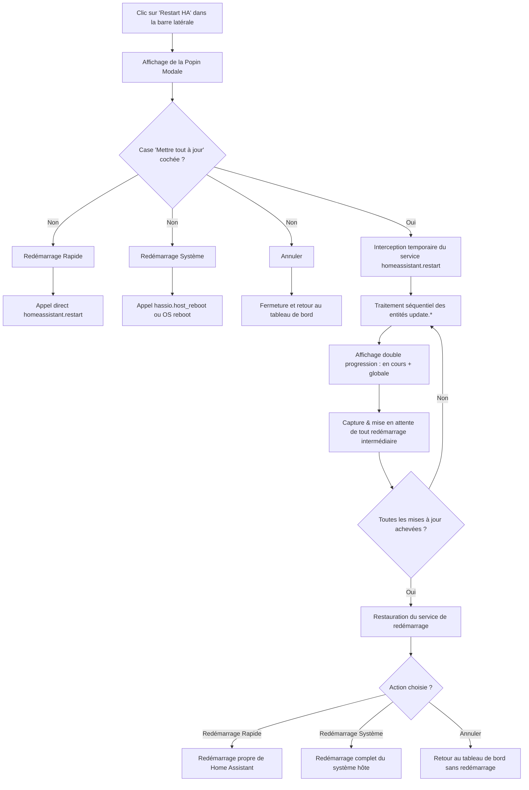

# Restart HA 🚀

Intégration Home Assistant personnalisée ajoutant un bouton dédié **Restart HA** dans la barre latérale gauche, ouvrant une popin modale pour redémarrer rapidement ou complètement votre système, avec la possibilité d'orchestrer la mise à jour complète de tous vos composants (intégrations, thèmes, add-ons, Core) avant le redémarrage.

---

## ✨ Fonctionnalités Principales

- **⚡ Panneau dans la barre latérale gauche** : Entrée directe nommée `Restart HA` avec icône dédiée.
- **🎨 Popin modale moderne & fluide** :
  - Design soigné avec effet de verre dépoli (*glassmorphism*), fond flouté et animations réactives.
  - S'ouvre instantanément au clic sur l'icône de la barre latérale.
- **🛠️ 3 Choix d'actions** :
  - **⚡ Redémarrage Rapide** : Redémarre Home Assistant immédiatement sans confirmation superflue.
  - **🖥️ Redémarrage Système** : Redémarre complètement la machine hôte (Home Assistant OS + Machine).
  - **❌ Annuler** : Ferme la popin et revient directement à l'accueil / tableau de bord Lovelace.
- **🔄 Option "Mettre tout à jour"** :
  - Détecte l'ensemble des entités `update.*` (intégrations HACS, intégrations custom, add-ons superviseur, thèmes, Core).
  - Affiche la liste des éléments à mettre à jour avec versions actuelles et cibles (`1.0.0 ➜ 1.1.0`).
  - **🛡️ Interception et blocage des redémarrages intempestifs** : Intercepte temporairement les appels à `homeassistant.restart` effectués par certaines intégrations lors de leur mise à jour, afin de garantir que **toutes** les mises à jour soient terminées avant de redémarrer.
  - Si combiné avec **Annuler** (Option A) : applique toutes les mises à jour en cours puis revient à l'accueil **sans redémarrer**.
- **📊 Doubles barres de progression dynamiques** :
  - **Barre d'avancement de l'élément en cours** : suit le pourcentage de téléchargement et d'installation de l'intégration traitée.
  - **Barre d'avancement globale** : affiche le statut cumulé de la file de traitement (`X sur Y`, pourcentage total).
  - Journal en temps réel des étapes (ex: interception d'un redémarrage auto, mise à jour réussie).
- **🏷️ Badge "MAJ" dans la barre latérale** :
  - Utilise la mécanique universelle persistante avec `MutationObserver`.
  - Injecte dynamiquement le badge stylisé dégradé rouge/orange `MAJ` dès qu'une mise à jour est en attente dans Home Assistant.

---

## 🏗️ Fonctionnement Technique

---

## 📥 Installation

### Méthode 1 : Via HACS (Recommandé)
1. Ouvrez **HACS** dans votre Home Assistant.
2. Cliquez sur les 3 points en haut à droite > **Dépôts personnalisés**.
3. Ajoutez l'URL : `https://github.com/SocrateMobile/Restart-HA` avec la catégorie `Intégration`.
4. Cliquez sur **Télécharger**.
5. Redémarrez une fois Home Assistant.

### Méthode 2 : Installation Manuelle
1. Téléchargez la dernière archive zip depuis la [page des Releases](https://github.com/SocrateMobile/Restart-HA/releases).
2. Copiez le dossier `custom_components/restart_ha` dans le répertoire `config/custom_components/` de votre Home Assistant.
3. Redémarrez Home Assistant.

---

## ⚙️ Configuration

Une fois installé, le panneau s'active automatiquement dans votre barre latérale gauche.
Vous pouvez également l'ajouter via l'interface :
**Paramètres** > **Appareils & Services** > **Ajouter une intégration** > chercher **Restart HA**.

---

## 🤝 Services Home Assistant disponibles

L'intégration expose également 3 services d'automatisation :

| Service | Description | Paramètres |
|---|---|---|
| `restart_ha.quick_restart` | Déclenche un redémarrage rapide de Home Assistant | `update_all` (booléen, optionnel) |
| `restart_ha.system_restart` | Déclenche un redémarrage complet de l'hôte | `update_all` (booléen, optionnel) |
| `restart_ha.update_all` | Lance les mises à jour avec interception | `action` (`quick_restart`, `system_restart`, `cancel`) |

---

## 📄 Licence

Ce projet est sous licence MIT. Voir le fichier [LICENSE](LICENSE) pour plus de détails.
Développé avec ❤️ par **SocrateMobile**.
